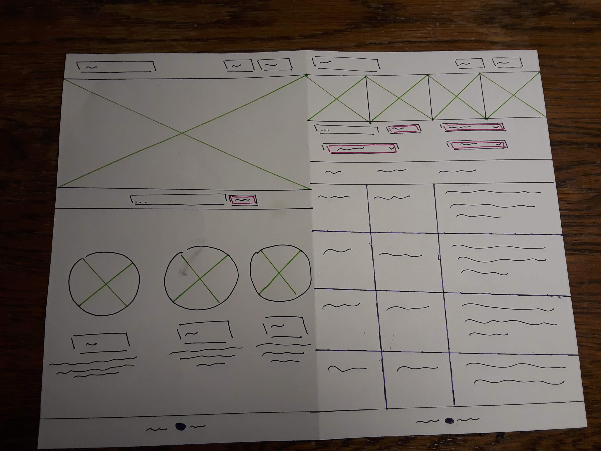

# Project 2: Design Journey

Be clear and concise in your writing. Bullets points are encouraged.

**Everything, including images, must be visible in VS Code's Markdown Preview.** If it's not visible in Markdown Preview, then we won't grade it.

## Catalog (Milestone 1)

### Describe your Catalog (Milestone 1)
> What will your collection be about? What types of attributes will you keep track of for the *things* in your catalog? 1-2 sentences.

My collection will be a curated collection of plants and trees that have medicinal properties.

Fields Listed:

+ Common Name: Text (Size: 30)
+ Scienctific Name: Text (Size: 40)
+ Other Names: Text (Size: 60)
+ Cure: Text (Size:20)

+ Location: Text (Size:20)
+ Lifespan: Text (Size:10)
+ Endangered:
+ Type: Text (Size:10)
+ Description: Chars (Size:200)
    + Includes Identification information such as leaf type, bark type, fruits, what part of the plant is used, interesting facts


### Target Audience(s) (Milestone 1)
> Tell us about your target audience(s).

The target audience is a plant enthusiast who many want to find natural remedies to simple sicknesses such as a cold and injuries such as a cut or someone who just wants to learn more about medicinal plants.


### Design Patterns (Milestone 1)
> Review some existing catalog that are similar to yours. List the catalog's you reviewed here. Write a small reflection on how you might use the design patterns you identified in your review in your own catalog.

Plant Catalog by Monrovia: https://www.monrovia.com/plant-catalog/

The main goal of this catalog is to help customers find plants that not only will grow where the customer is located, but also meets their landscaping needs. If a plant is not available for sale online the catalog leads the user to other retailers that carry the plant.

* Provides two main ways of discovering plants
    + Using the common name
    + Using the botanical name
* Allows the user to filter for plants using various attributes such as plant type, water needs, landscape use, flowering season etc.
* Once a search is made pictures of the plants shop up in rows with it's common name, botanical name, item number on the catalog, and one good thing about the plant.
* When the user clicks on a certain plant more information about the plant, where it grows, it's care needs, and benefits are listed.

Plant Catalog by Annie's Annuals and Perennials:
https://www.anniesannuals.com/

The main goal of this catalog is also to help customers find the best plant that they may be intrested in.

* Unlike the previous catalog there are a lot more filters in this catalog as well as a search bar.
* As this is the catalog of the plant store it self it is designed like an online store.
    + Where thumbnails of plants with its picture and name shows up
    + The user can either add it to their shopping list or to a wishlist.

Using these two examples of plant catalogs, I have some idea as to which fields maybe necessary to help users find products they like. For example Location is a very important field that I didn't think of earlier.

## Design & Planning (Milestone 2)

## Design Process (Milestone 2)
> Document your design process. Show us the evolution of your design from your first idea (sketch) to design you wish to implement (sketch). Show us the process you used to organize content and plan the navigation, if applicable.
> Label all images. All labels must be visible in VS Code's Markdown Preview.
> Clearly label the final design.





## Partials (Milestone 2)
> If you have any partials, plan them here.


## Database Schema (Milestone 2)
> Describe the structure of your database. You may use words or a picture. A bulleted list is probably the simplest way to do this. Make sure you include constraints for each field.

Table: movies
- field 1: description..., constraints...
- field...


## Database Query Plan (Milestone 2)
> Plan your database queries. You may use natural language, pseudocode, or SQL.]

1. All records

    ```
    TODO
    ```

2. Search records

    ```
    TODO
    ```

3. Insert record

    ```
    TODO
    ```


## Code Planning (Milestone 2)
> Plan any PHP code you'll need here.


# Reflection (Final Submission)
> Take this time to reflect on what you learned during this assignment. How have you improved since Project 1? What things did you have trouble with?
