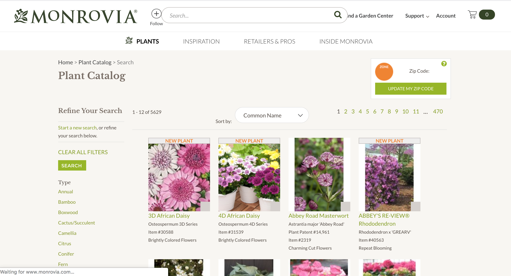
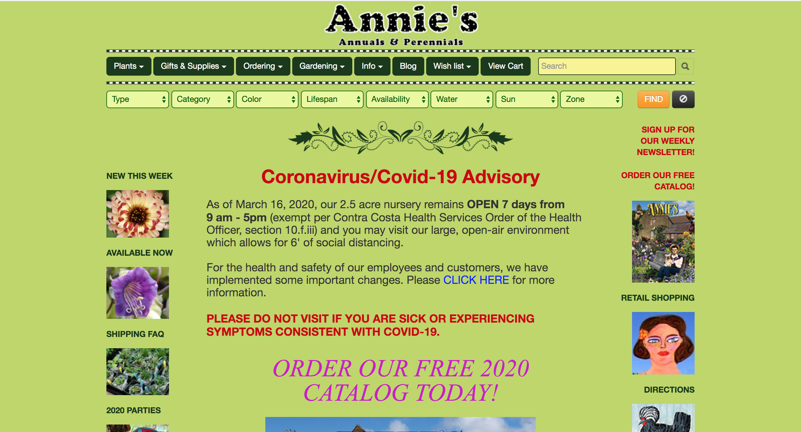
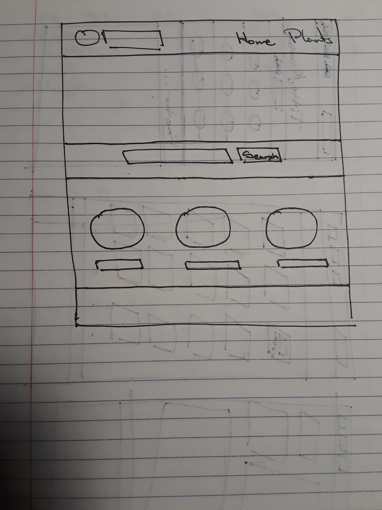
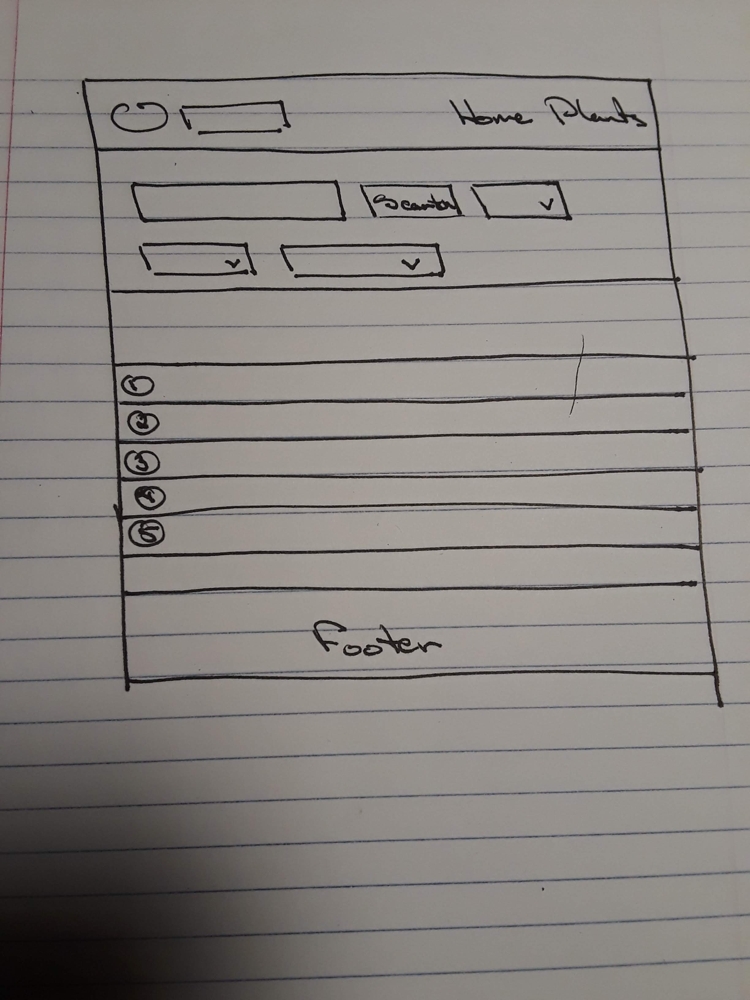
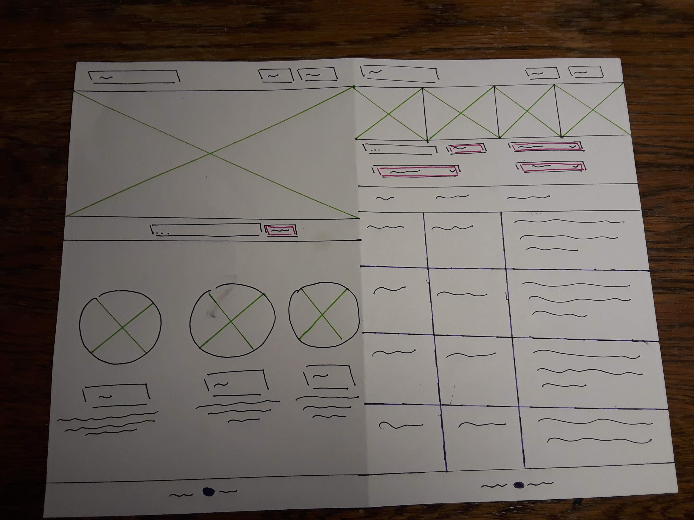
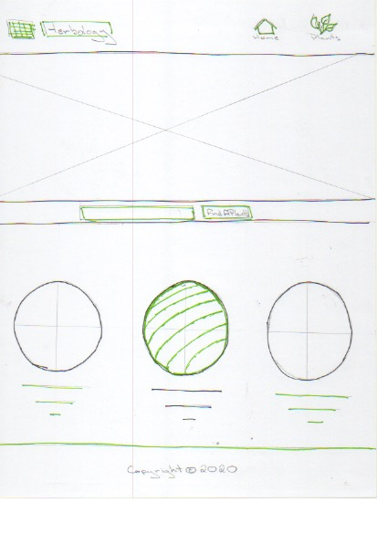
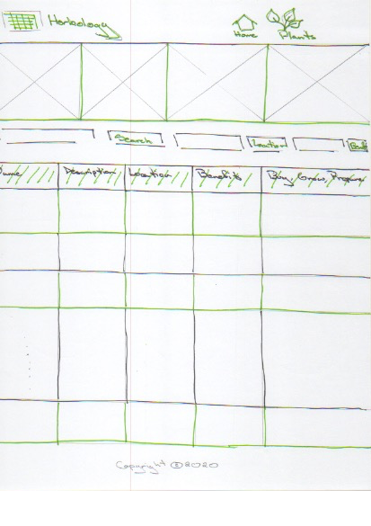
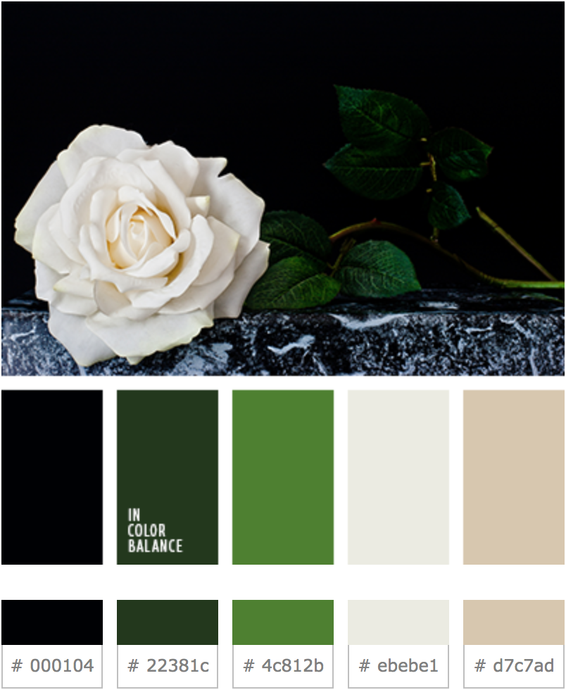
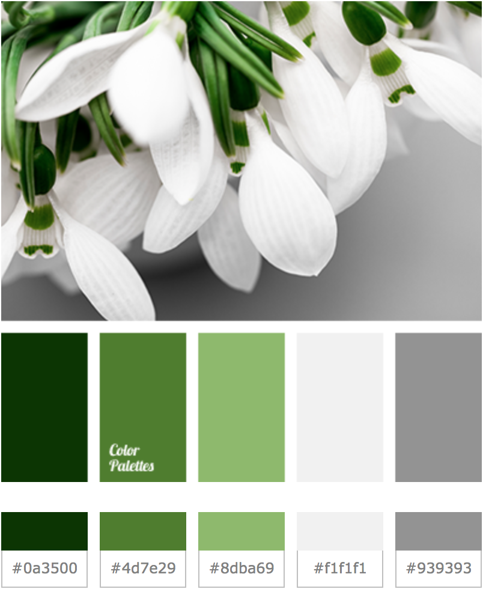

# Project 2: Design Journey

Be clear and concise in your writing. Bullets points are encouraged.

**Everything, including images, must be visible in VS Code's Markdown Preview.** If it's not visible in Markdown Preview, then we won't grade it.

## Catalog (Milestone 1)

### Describe your Catalog (Milestone 1)
> What will your collection be about? What types of attributes will you keep track of for the *things* in your catalog? 1-2 sentences.

My collection will be a curated collection of herbs and plants that have medicinal properties.

Brainstorming for Fields Listed:

My first vision of the website was more focused on the attributes of plants and herbs where I decided to showcase the following fields.

+ Common Name: Text (Size: 30)
+ Scienctific Name: Text (Size: 40)
+ Other Names: Text (Size: 60)
+ Cure: Text (Size:20)

+ Location: Text (Size:20)
+ Lifespan: Text (Size:10)
+ Type: Text (Size:10)
+ Description: Chars (Size:200)
    + Includes Identification information such as leaf type, bark type, fruits, what part of the plant is used, whether its endangered, and other interesting facts

However, after interviewing a few plant enthusiasts as well as people interested in herbal medicine, I realized there is more interest in the benefits of a plant and how to attain them, rather than the specifics of identifying a plant. Thus, I updated my fields accordingly and made sure to decrease the number of fields so that people get the most interesting information with little reading.

+ Name: Text (Size: 100)
+ Description: Chars (Size:200)
    + Includes Identification information such as leaf type, bark type, fruits, location, where you may come across such a plant, etc.
+ Location: Text (Size:400)
    + Country and Ecosystem
+ Benefits: Text (Size:100)
    + Antibacterial, antiinflammatory, digestive benefits etc.
+ Prepare: Text (Size:400)
    + how to apply it or ingest it


### Target Audience(s) (Milestone 1)
> Tell us about your target audience(s).

The target audience is a plants or herbs enthusiast who wants to learn how to heal naturally inside and out.


### Design Patterns (Milestone 1)
> Review some existing catalog that are similar to yours. List the catalog's you reviewed here. Write a small reflection on how you might use the design patterns you identified in your review in your own catalog.

<!-- Source: https://www.monrovia.com/plant-catalog/  -->
Plant Catalog by [Monrovia](https://www.monrovia.com/plant-catalog/):




The main goal of this catalog is to help customers find plants that not only will grow where the customer is located, but also meets their landscaping needs. If a plant is not available for sale online the catalog leads the user to other retailers that carry the plant.

* Provides two main ways of discovering plants
    + Using the common name
    + Using the botanical name
* Allows the user to filter for plants using various attributes such as plant type, water needs, landscape use, flowering season etc.
* Once a search is made pictures of the plants shop up in rows with it's common name, botanical name, item number on the catalog, and one good thing about the plant.
* When the user clicks on a certain plant more information about the plant, where it grows, it's care needs, and benefits are listed.

<!-- Source: https://www.anniesannuals.com/  -->
Plant Catalog by [Annie's Annuals and Perennials](https://www.anniesannuals.com/):



The main goal of this catalog is also to help customers find the best plant that they may be intrested in.

* Unlike the previous catalog there are a lot more filters in this catalog as well as a search bar.
* As this is the catalog of the plant store it self it is designed like an online store.
    + Where thumbnails of plants with its picture and name shows up
    + The user can either add it to their shopping list or to a wishlist.

These two websites both have very through information, however a lot of times it seems that all information jumps at the user at once confusing them as to where to look. This could be improved by taking a minimalistic approach on the overall catalog and only show the most important information. The details are better suited for the description page of each of the plants. Also as I am creating an informational catalog instead of a shopping catalog, I will focus on the information that helps the reader get to know the plant and it's benefits as opposed to specific details about price range and planting information

## Design & Planning (Milestone 2)

## Design Process (Milestone 2)
> Document your design process. Show us the evolution of your design from your first idea (sketch) to design you wish to implement (sketch). Show us the process you used to organize content and plan the navigation, if applicable.

### Initial Design Planning:

The initial idea was to create a catalog with images in a similar way to a shopping cart and have each of the images lead to a separate page with all the information for the plant. However as this would be too extensive, I decided to create two pages. One that stars a few plants with multitudonal benefits and another page with detainled information about of the plants as a table.

As I was thinking of the different components that I may want to include in the webiste I drew a quick skeitch with of the layout.


*<div align='center'>This is the first page with a nav bar, a showcase, a search ribbon, a plant showcase and a footer.</div>*


*<div align='center'>This is the second page that has the nav bar, the footer, search and filter methods, and the catalog. </div>*

After the quick sketch I went on to put more details on each of the features and tried out different colors to understand what design would give the users the best experience. I chose green to be consistent with the natural theme of the website and a few bright pastel colors to highlight the functional features of the website. This is so that users are easily guided to the interactive parts of the website.


*<div align='center'> This is the sketch of the website with both pages side by side. This was done so that I stayed consistent with the design on both of the pages.</div>*

The left half of the page contains the home page with a navigation bar, a showcase area, a search ribbon, a showcase of plants, and footer. The right half of the page contain the second page which main contains the nav bar, an image ribbon, a search bar, filter buttons, and upload button ribbon, the catalog, and a footer. The design has updated to be more aesthetically pleasing, concise with a good amount of white space, and an easily interactive search bar and filtering buttons. Once the user clicks the upload button a form will show up prompting them to add information in the directed fields.

## Final Design Sketch:

After finalizing all the features I wanted to add more detail to the features and redesign the color scheme to stay consistent with the natural theme. I also wanted to showcase a minimalistic design so that the a sense of serenity induced and the user doesnt feel cluttered. This way can take in the information more effectively and retain it better for future use.

*<div align='center'>This is the Homepage that showcases the theme of the website.</div>*

*<div align='center'>This is the interactive catalog page that informs the user</div>*

I decided to stick to a black and white outline of the website to give it a modern feel. So that the user instantly is reminded of the serenity in nature I used green. On the website a variety of green colors will be used to blend in the features as well as highlight important interactive features.

*<div align='center'>This picture from [Color Palette](https://color.romanuke.com/tsvetovaya-palitra-2366/)  is an example of the color scheme that will fit the theme while keeping a modern look. These colors hold a warm tone that makes the user feel eaily welcome.</div>*

*<div align='center'>This scheme is also from [Color Palette](https://colorpalettes.net/color-palette-3998/)]. These colors are the more vibrant version of the previous scheme that induces an energetic atmosphere.</div>*

## Partials (Milestone 2)
> If you have any partials, plan them here.

The nav bar and the footer will be in partials since they are crucial to both of the pages. The navigation bar will allow users to access the main two pages at any time, so they are never lost in the website. I will include the name of the website and the links to the pages. The footer will include the copyright information and any image citations.


## Database Schema (Milestone 2)
> Describe the structure of your database.

The database will consist of one table, plants, where each plant will identified using a unique id. All of the supporting information will also be contained in the same table. The _ infront of name, description, and location is used to differentiate from the inherent name, description, and location values in sql.

<div align='center'>

|plants| Constraints |
|-----|--------------|
| id | Integer |
| _name | Text (Size: 100) |
| benefits | Text (Size:200) |
| _description | Text (Size: 400) |
| _location | Text (Size: 100) |
| prepare | Text (Size:400) |

</div>


## Database Query Plan (Milestone 2)
> Plan your database queries. You may use natural language, pseudocode, or SQL.]

1. All records

    ``` SQL
    TODO

    SELECT name AS Name,
        benefits AS Benefits
        description  AS Description,
        location AS Location,
        buy_grow_prepare AS Buy, Grow, Prepare
    FROM Plants;

    ```

2. Search records

    ``` SQL
    TODO
    <!-- When using the search bar -->
    SELECT * FROM Plants
    WHERE search_input = SUBSTR(name,search_input) OR
            search_input = SUBSTR(benefits,search_input) OR
            search_input = SUBSTR(description,search_input) OR
            search_input = SUBSTR(location,search_input) OR
            search_input = SUBSTR(prepare,search_input);

    ```

3. Insert record

    ``` SQL
    TODO
    <!-- First create a form where the user can input the different fields required to add data to the catalog. Filter the inputs and assign them to variables using PHP. If the user doesn't input data for certain fields assign them ''. Then use SQL to insert the data in to the database. -->
    INSERT INTO plants (name, benefits, description, location, grow_prepare) VALUES (:name, :benefits, :description, :location, :grow_prepare);

    ```


## Code Planning (Milestone 2)
> Plan any PHP code you'll need here.

``` php
// Plan for conducting a search through the database
if (isset($_GET['search'])) {
    // Sanitize all inputs using VALIDATE and SANITIZE
    // Conduct the search and provide correctional feedback
} else {
  // Set search query to NULL
}
if (//search was conducted) {
    // TODO: write the queries
    // TODO: display the data
}else {// No results found
}

function print_data{
    // TODO: a function that helps print the data
}

// Plan for inserting data into database
if ($_SERVER['REQUEST_METHOD'] == 'POST') {
    // TODO: sanitize and validate all input values
    // TODO: insert valid reviews into database
  if ($valid_review) {
    $sql = "INSERT INTO table (...) VALUES (...)";
    $params = array(...);
    $result = exec_sql_query($db, $sql, $params);
    // TODO: Show confirmation of whether the data was added to the table
}
```

# Reflection (Final Submission)
> Take this time to reflect on what you learned during this assignment. How have you improved since Project 1? What things did you have trouble with?
